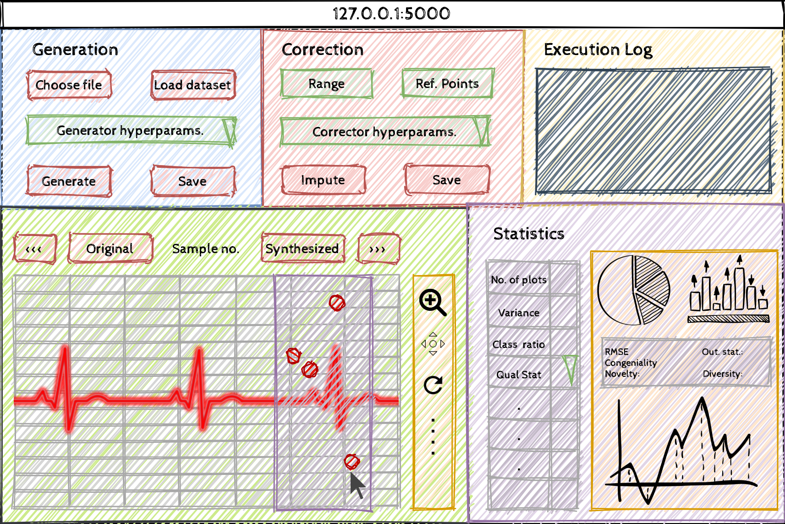
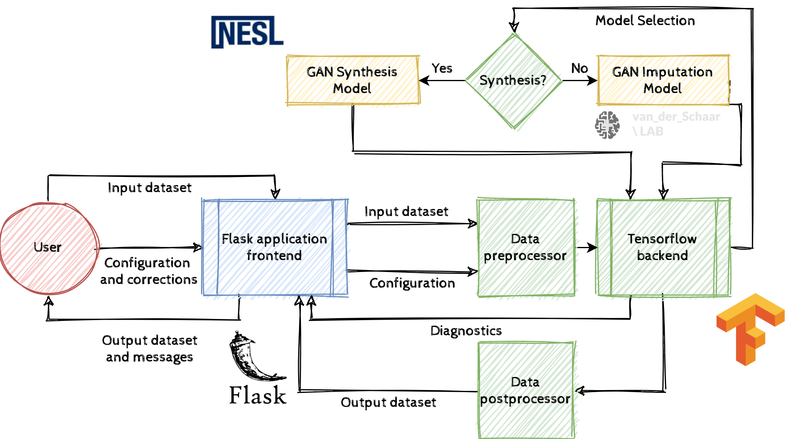

# HMM-T9: GUI-GAN: Towards an interactive graphical framework for privacy-preserving artificial data synthesis and imputation using generative adversarial networks.

*Elevator Pitch: We have designed a graphical framework for generating large amounts of realistic but privacy-preserving synthetic sensory data from limited real-world data in any discipline, while also allowing the user to modify the generated data using graphical tools.*

Demo Video: https://youtu.be/b78lVvjH8vc 

GUI-GAN is a real-time and interactive graphical user interface (GUI) framework for synthesizing large time-series datasets from moderately-sized input datasets using Generative Adversarial Networks (GANs). Specifically, we illustrate a generalizable graphical pipeline powered by a deep-learning backend that allows non-experts to generate synthetic sensory data while parameterizing synthetic data statistics via graphical tools. In addition, the framework allows the user specify rectification statistics of generated data via graphs and symbols, which is then fed to another generative deep-learning pipeline for data imputation based on user-corrections. Features of the framework are:

* Generates privacy preserving annotated multi-class datasets from small time-series datasets in any domain
* Collaborative and controllable: allows user to make graph-based and symbolic corrections to groups of generated datasets as well as control GAN parameters in non-technical manner.
* Aimed for non-experts: assumes zero machine-learning and coding expertise; runs on any generic computing device without requiring expensive computing equipment

For data synthesis, we input the data and user conditions to a VAE generator based GAN called PhysioGAN (https://escholarship.org/uc/item/3xm7j6nw). The encoder-decoder networks map training data to latent space and perform reconstruction, while the discriminator forces the generator to follow the coveted data distribution as closely as possible. (For mid-term prototype, we used a simplified version of PhysioGAN called SenseGen (https://ieeexplore.ieee.org/document/7917555)). For data imputation, we feed the input data, mask metadata characterizing missing data and a random matrix to the generator network, while the discriminator uses the generator output (imputed data) coupled with a hint matrix to try and distinguish between observed and imputed components. This model is called GAIN (http://proceedings.mlr.press/v80/yoon18a/yoon18a.pdf).

References:
1. Alzantot, Moustafa Farid Taha Mohammed. “Secure and Private Machine Learning for Smart Devices”. Ph.D. Diss. UCLA, 2019.
2. Yoon, Jinsung, James Jordon, and Mihaela van der Schaar. " GAIN: Missing Data Imputation using Generative Adversarial Nets. " International Conference on Machine Learning (ICML). 2018.
3. Alzantot, Moustafa, Supriyo Chakraborty, and Mani Srivastava. "Sensegen: A deep learning architecture for synthetic sensor data generation." 2017 IEEE International Conference on Pervasive Computing and Communications Workshops (PerCom Workshops). IEEE, 2017.
